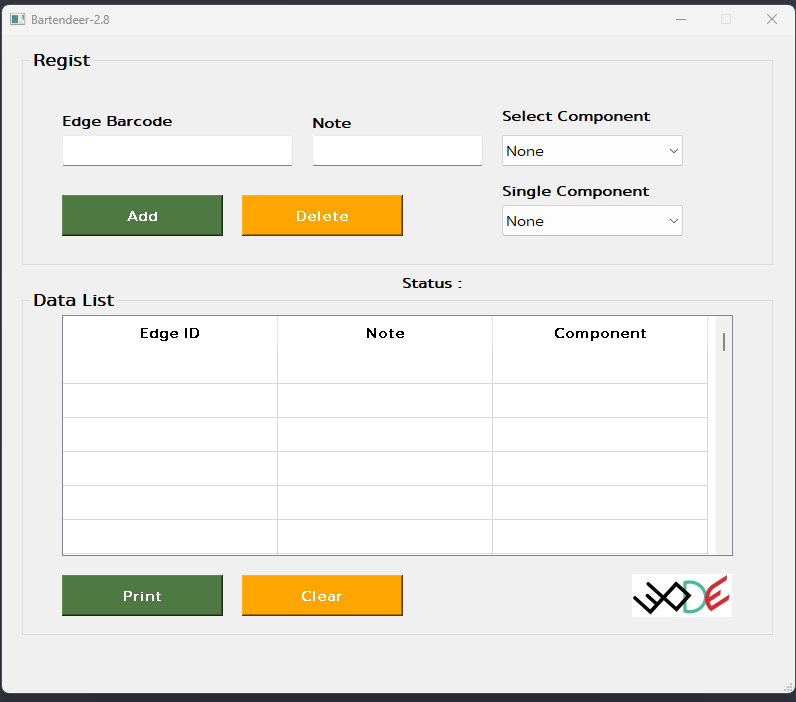

<H1>Bartendeer</H1>
This program is designed for use as a data trigger in an automation printing system. I developed it from an Excel file into a system that is accessible for users with a GUI and a database.

<H3> Feature </H3>

- The program is flexible, allowing users to select components (Floor Set or Single).
- Easy to register and can print large amounts of data.
- The application utilizes both CSV files and databases to store historical data.

<H1>Overview</H1>

 
  
   
 

 Figure : Bartendeer Ver2-8 
 

In this figure, users can input data in the 'Register' group and click 'ADD' to add the data to the system. The entered data will be displayed in the 'Data List' table. When the amount of data equals the set point, the automatic print function will activate. Users can manually print by clicking 'Print' or clear data in the 'Data List' table using the 'Clear' button. The 'Delete' button is used to remove data that has been added to the 'Data List' table. To delete a specific entry, enter the corresponding data number and click 'Delete'.

 
